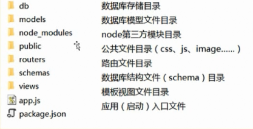

**一、静态文件（css，js）**

1.静态文件托管(公开)：**app.use('/www',express.static(__dirname+'/public'));**

​		当用户访问的url以/www开始的时候，那么直接返回对应__dianame+'/public'下的文件。然后访问的时候就只要输入：/www/.../css  或者是Js

​		用户发送http请求	--->	url 	-->	解析路由	-->找到匹配的规则	-->执行指定绑定的函数，并且返回对应内容至用户

​		/public--->静态--->直接读取指定目录下的文件，返回给用户。

​		动态-->处理业务逻辑，加载模板，解析模板---->返回数据给用户。

​	//在开发中需要取消模块缓存

​	swig.setDefaults({cache:flase});

​	创建一个路由对象：var router =express.Router();

**2.第三方模块和中间件：**

bodyParser:解析post请求数据

cookies:读写cookie

swig:模块解析引擎

MySQL：操作数据

markdown:markdown语法解析生成模块。

#### 二、基础框架:

**1.目录结构：**



```
1  app.js：应用程序的入口文件
//加载express模块
var express=require('express');
//创建app应用==>Node.js Http.createServer();
var app=express();

//监听端口
app.listen(3000,function(){

})
```

**2.用户的访问：**

​	1）用户通过url访问web应用，如：http://localhost:3000/

​	2）web后端根据用户访问的url处理不同的业务逻辑

**3.路由绑定：**

通过app.get()或者app.post()等方法可以把一个url路径和一个或者N个函数进行绑定

​	

```
app.get('/',function(req,res,next){
	req：request对象-保存客户端请求相关的一些数据-http.request
	res:response对象-服务端输出对象，提供了一些服务器端输出相关的一些方法-http.respomse
	next:方法，用于执行下一个和路径匹配的函数（一个路径可以匹配多个函数）

//读取views目录下的指定文件，解析并返回给客户端
//第一个参数：表示模板的文件，相对于views目录，
//第二个参数;传递给模板使用的数据
	res.render();
})
```

**4.内容输出：**

​		通过res.send(string)发送内容至客户端

**三、模板引擎的配置和使用：**

**1.模块的使用**

​		后端逻辑和页面表现分离-前后端分离

**2.模板配置**

```
引入要使用的模板
var awig =require('swig');
app.engine('html',swig.remderFile);
定义当前应用使用模块引擎，使用swig.renderFile方法解析 后缀为html的文件
app.set('views' ,'/views');//设置模板存放目录
app.set('view engine','html');//注册模板引擎
swig.setDefaults({cache；flase});//取消模板缓存
```


**三、模块开发：**
			模块划分：根据功能进行模块划分（**前台模块，后台管理模块，API模块**【通过AJAX调用的一些接口】）

**放在app.js中**

​			使用app.use()进行模块划分

```
根据不同的功能划分不同的模块。后台管理
app.use('/admin',require('./router/admin'));
如果路由是以/admin开头的就会区请求路由里面的admin.js（在这个文件夹中处理后台管理的url）需要将路由对象导出。
app.use('/api',require('./router/api'));
app.use('/',require('./router/main'));
```

**main模块：**

```
	/		首页
	/view	内容页
```

**api模块：**

```
	/				首页
	/register		用户注册页
	/login			用户登陆
	/comment		评论获取
    /comment/post	评论提交
```

**admin模块:**

```
		/			首页
用户管理
		/			用户列表
分类管理
		/category			分类列表
		/category/add		分类添加
		/category/edit		分类修改
		/category/delete	分类删除
文章内容管理
		/article			内容列表
		/article/add		内容添加
		/article/edit		内容修改
		/article/delete		内容删除
评论内容管理
		/comment			评论列表
		/comment/delete		评论删除
```

**功能开发顺序：**

​			用户----->栏目------>内容------->评论

**编码顺序：**

​			通过Schema定义设计数据存储结构（数据库设计）--->功能逻辑----->页面展示。

**要考虑清楚哪一个模块先开发，然后做后台管理，然后再去做前台展示。**


**用户注册：**

1. UserSchema结构设计

   ​	开一个user.js，在app.js里面加载数据库，并且通过数据库下面的mysql.connect()连接数据库。

   ```
   //引入数据库模块
   var mysql =require('mysql');
   //用户表结构
   module.exports = new mysql.Schema({
   	//用户名
   	username：String,
   	//密码
   	password:String
   });
   ```

2. 注册页面

3. 注册逻辑

   1. 使用AJAX方法实现注册
   2. API 接口实现
   3. 用户名是否为空，密码不能为空，两次输入密码必须一致
   4. 用户是否已经被注册（涉及数据库查询）

数据库连接：先引入数据库（var  mysql =require('mysql')）;

在app.js中加载数据库模块。同时在app.js中使用mysql.connect();连接数据库。

注册可以通过AJAX提交请求

```
$ registerBox.find('button').on('click',function(){
$.ajax({
	type:'post',
	url:'/api/user/register',
	data:{
            username:$registerBox.find('[name="username"]').val(),
            password:$registeBox.find('[name="password]"").val(),
            repassword:$register.find('[name="repassword"]').val(),
		},
            dataType:'json',
            seccess:function(result){
                console.log(result);
		}
	})
})
```

Body.parser模块的使用(用于处理post 提交过来的数据，所以需要先在app.js里面加载)

body.parser设置

app.use(bodyParser.urlencoded({extended:true}));

**req.body获取的是post请求。**


